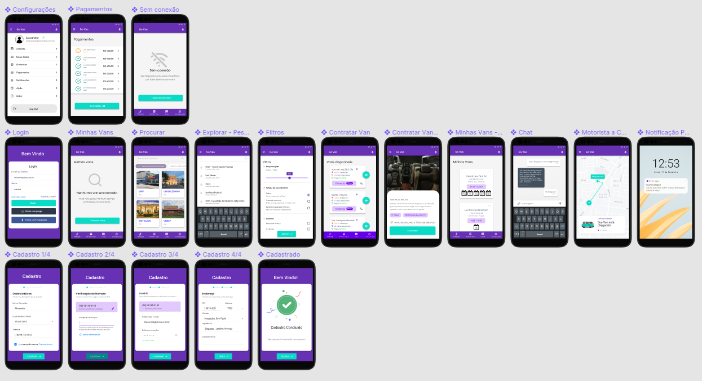
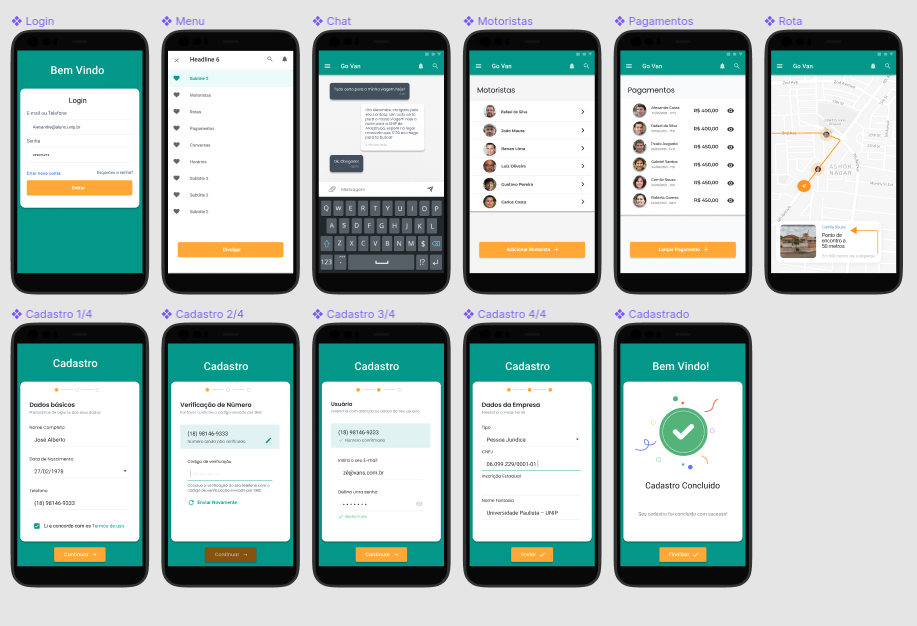

# goVan TCC - Front-End (Public archive)

## About

GO VAN: Software de locomoção urbana para transportador e clientes

- (PT-BR) Trabalho de conclusão de Curso (TCC) de Ciência da Computação na UNIP - Universidade Paulista em Araçatuba-SP.
- (EN-US) Final Paper for my Computer Science Course at UNIP - Universidade Paulista at Araçatuba-SP, Brazil.

## Contributors

- Michael Dionisio
- Natan Amorim S. G. de Moraes
- Rafael Pereira de Moura

## Concept

### GoVan Passenger

<h1 align="center">
    
</h1>

### GoVan Manager

<h1 align="center">
    
</h1>

## API

- (EN-US) needs [goVan API - Rafael Moura](https://github.com/rafaelmoura3/APIGoVan) to work.
- (PT-BR) Necessita da [goVan API - Rafael Moura](https://github.com/rafaelmoura3/APIGoVan) para funcionar.
